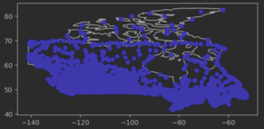

# Technologies and Architecture

## Final architecture
### Apache Spark

### Amazon Elastic MapReduce (EMR) 

### Amazon Simple Storage Service (S3)

### Amazon Glue

### Amazon Athena

### Amazon Quicksight

## Outcomes from the evaluation of various technologies

### Visualization
* Matplotlib/Seaborn 
  * The library has to be used with GeoPandas, so we would need to transform Spark’s Dataframes into Panda’s Dataframes. This approach would take more computation power. Furthermore, we must implement every graph from scratch and deploy a frontend.
  * 
* Seaborn
  * Similar arguing
* Elastic Cloud and Kibana
  * It can be connected with AWS, but it needs an entirely new IAM (new credentials and role management) and isn’t free so we wouldn’t save costs (Only during the trial period)
  * Kibana is more optimized for Elastic’s products, especially Elasticsearch
  * https://www.elastic.co/guide/en/logstash/current/plugins-inputs-s3.html
  * Kibana can be set up on-premise for free entirely for our use case, but we would have needed to deploy it, make it accessible and think about scaling (that’s not what we want. We want to rely on SaaS!)
* Tableau 
  * Similar arguing as with Kibana 
* Amazon Quicksight 
  * This service can be used on-demand in our existing AWS setup (centralized services, same system environment) with the same IAM, can be scaled quickly and doesn’t need much configuration effort. It is optimized and well-documented for AWS products 
  * More benefits:
    * https://aws.amazon.com/quicksight/ (See “Benefits”)
    * https://www.saviantconsulting.com/blog/7-benefits-amazon-quick-sight.aspx

### Amazon DynamoDB
* We experienced massive loading times from S3 to Athena 
* Needs a lambda function as a connector 
* We would create multiple copies of our dataset 
* More complex architecture 
* No cost benefit (the DB has to run, serverless computations are better)
* Solution:
  * We will store the raw data in S3, transform it via EMR and store it in another bucket. 
  * We will use AWS Glue to connect Athena with our S3 buckets, so we replace DynamoDB and Lambda with AWS Glue and connect our dataset directly to Athena. 
  * Athena is serverless, so we only pay what we execute
 
### Spectrum vs Athena
* Redshift Spectrum runs with Amazon Redshift, while Athena is a standalone query engine for querying data stored in Amazon S3.

* With Redshift Spectrum, you have control over resource provisioning, while in the case of Athena, AWS allocates resources automatically.

* The performance of Redshift Spectrum depends on your Redshift cluster resources and optimization of S3 storage, while the performance of Athena only depends on S3 optimization. Initial transformation work was completed at S3 with EMR cluster. Data stored as parquet files and partitioned according to requirement (observation type).

* Redshift Spectrum can be more consistent performance-wise while querying in Athena can be slow during peak hours since it runs on pooled resources.

* Redshift Spectrum is more suitable for running large, complex queries, while Athena is more suited for simplifying interactive queries.

* Redshift Spectrum needs cluster management, while Athena allows for a truly serverless architecture.

### Athena results - storing|editing|downloading|accessing

* AWS stores athena query results automatically to S3 buckets. These results include .csv and .txt of both result and metadata.
* The result from recent queries are stored upto 45 days and automatically deleted after that. But we can choose to extend this duration should we need the result for a longer duration
* The results can be viewed at anytime, edited and even downloaded for further analysis or visualization.
https://docs.aws.amazon.com/athena/latest/ug/querying.html
